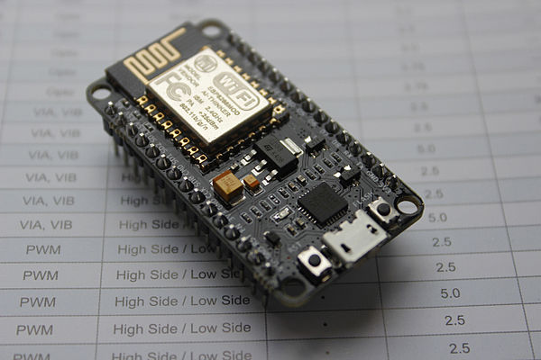
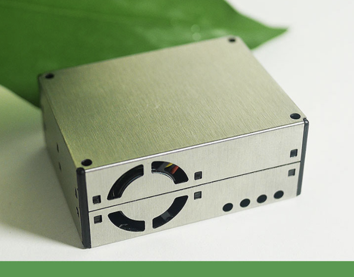
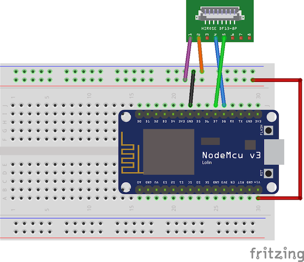
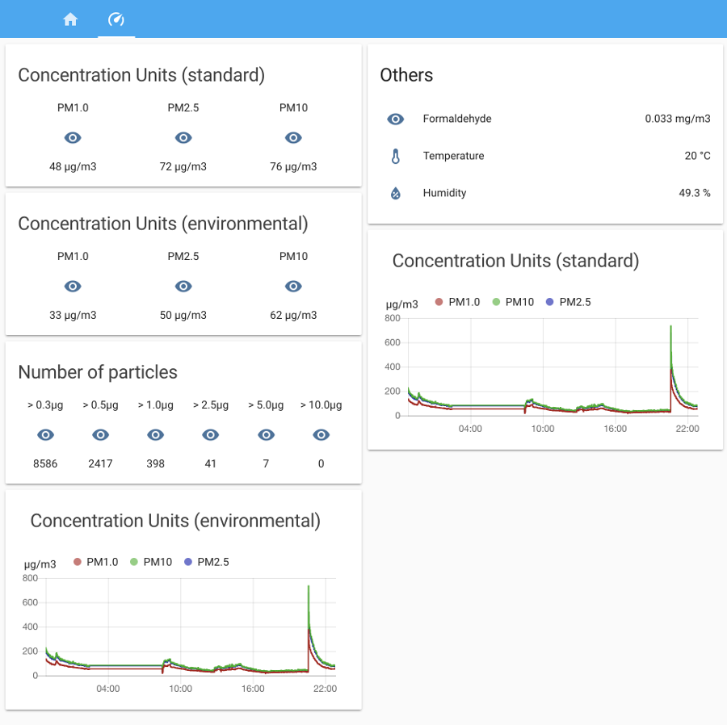

# Air Quality Meter
> "There's so much pollution in the air now that if it weren't for our lungs there'd be no place to put it all."
> \- Robert Orben
 
Detects **air particulate matter** (PM - pm1, pm2.5, pm10) concentrations with a **Plantower PMS5003ST** sensor and sends data to an **MQTT topic**. 

An alternative firmware for _ESP8266 devices_ like the [NodeMCU](https://github.com/nodemcu/nodemcu-firmware) board written for [**Arduino**](https://www.arduino.cc/) on [**PlatformIO**](https://platformio.org/)

[](https://github.com/rpanfili/airQualityMeter/blob/development/LICENSE.txt)

### Disclaimer

We don't take any responsibility nor liability for using this software nor for the installation or any tips, advice, videos, etc. given by any member of this site or any related site.

## Hardware
### NodeMCU
An **opensource IoT platform**, tiny and powerful, based on the **ESP-12** module.
It's very affordable (you can buy _them_ for a few bucks) and you can develop custom firmwares like this one using _Lua_ scription language or in _C/C++_ with the _arduino_ tools!



[NodeMCU on Wikipedia](https://en.wikipedia.org/wiki/NodeMCU)

### Plantower PMS5003ST
A **digital particle concentration sensor** that count the number of suspended particles in the air using a laser and the scattering principle and output them as digital data.
It's not expensive and you can find it on almost every marketplace like AliExpress.

The **ST version** that I used works differently from the **PMS5003** standard because has also a formaldehyde, temperature and humidity sensor so it needs to transfer more data.



## Installing / Getting started

A quick introduction of the minimal setup you need to get all up and
running. Remember that you *can* do all the setup steps without the PMS sensor connected!

#### Get [PlatformIO](https://platformio.org/) up and running
If you are used to this kind of software you already know how easier is to manage project dependencies, custom build routine, etc but if you are not don't worry! It's really easy and this can be a good starting point to learn something new :) You only need to [install it](https://platformio.org/platformio-ide) for your favorite IDE between Atom and VSCode.

#### [NOT REQUIRED] - Create configuration file
If you would like it you can create a configuration file to **preload all parameters** and skip the access-point mode configuration step later.
Copy the boilerplate configuration into `data/config.json`:
  
```shell
cd data
cp config.json.dist config.json
```
and modify it.
If you want you can configure only some of the parameters. Remove the property or leave it empty to use default project values.

#### Flash the module
Connect the NodeMCU via usb and from the top menu press **"PlatformIO" >> "Build"** and hopefully that's all! 

### Initial Configuration

After being flashed this application needs almost no configuration. Just to setup the desired wifi network.
To do that power the device up using the module micro-usb port. It'll boot in Access-point mode and a new wifi ssid will be available:
```
ssid: AQM-xxxxxx
pass: stop_air_pollution
```
Connect to that and a configuration page it will be displayed to you. If it'll not happen just open the browser and go to [http://192.168.4.1](http://192.168.4.1)

Follow the instructions and you will configure the sensor "everyday" network!

If you want you can skip this part using the `data/config.json` **configuration file**. If you are interested in it check [this paragraph about]([NOT REQUIRED] - Create configuration file)

## Usage

This are the minimal wiring that this project needs:



([fritzing schematics](resources/airQualitySensor.fzz) attached)

| PMS PIN | NodeMCU PIN | PMS wire color | 
| ------ | ------ | ------ |
| 1 (VCC) | VIN | <span style="color:purple">purple</span> |
| 2  (GND)| GND | <span style="color:orange">orange</span> |
| 3 (SET) |  | <span style="color:white; background-color: black">white</span> |
| 4 (RX)| D8 | <span style="color:blue">blue</span> |
| 5 (TX)| D7 | <span style="color:green">green</span> |
| 6 (RESET)|  | <span style="color:yellow">yellow</span> |
| 7 (NC)|  | <span style="color:black">black</span> |
| 8 (NC)|  | <span style="color:red">red</span> |

## (extra) HomeAssistant

I personally collect all these data on my **HomeAssistant** instance. It's an opensource home automation software that runs perfectly on micropc like **RaspberryPI** or local servers (NAS, nuc, etc)

Take a look at [https://www.home-assistant.io/](https://www.home-assistant.io/)

This is the sensor configuration:
```yaml
homeassistant:
  sensor:
    - platform: mqtt
      state_topic: "my_house/entryway/air_quality_meter"
      name: "air_quality_meter"
      value_template: '{{ value_json }}'
      json_attributes:
        - pm10
        - pm25
        - pm100
        - pe10
        - pe25
        - pe100
        - pt03
        - pt05
        - pt10
        - pt25
        - pt50
        - pt100
        - hcho
        - tem
        - hum

    - platform: template
      sensors:
        air_quality_pm10:
          friendly_name: PM1.0
          value_template: '{{ states.sensor.air_quality_meter.attributes.pm10 }}'
          unit_of_measurement: 'μg/m3'
        air_quality_pm25:
          friendly_name: PM2.5
          value_template: '{{ states.sensor.air_quality_meter.attributes.pm25 }}'
          unit_of_measurement: 'μg/m3'
        air_quality_pm100:
          friendly_name: PM10
          value_template: '{{ states.sensor.air_quality_meter.attributes.pm100 }}'
          unit_of_measurement: 'μg/m3'        
        air_quality_pm10_env:
          friendly_name: PM1.0 (atmospheric environment)
          value_template: '{{ states.sensor.air_quality_meter.attributes.pe10 }}'
          unit_of_measurement: 'μg/m3'
        air_quality_pm25_env:
          friendly_name: PM2.5 (atmospheric environment)
          value_template: '{{ states.sensor.air_quality_meter.attributes.pe25 }}'
          unit_of_measurement: 'μg/m3' 
        air_quality_pm100_env:
          friendly_name: PM10 (atmospheric environment)
          value_template: '{{ states.sensor.air_quality_meter.attributes.pe100 }}'
          unit_of_measurement: 'μg/m3'

        air_quality_pt03:
          friendly_name: Particles > 0.3um / 0.1L air
          value_template: '{{ states.sensor.air_quality_meter.attributes.pt03 }}'
        air_quality_pt05:
          friendly_name: Particles > 0.5um / 0.1L air
          value_template: '{{ states.sensor.air_quality_meter.attributes.pt05 }}'        
        air_quality_pt10:
          friendly_name: Particles > 1.0um / 0.1L air
          value_template: '{{ states.sensor.air_quality_meter.attributes.pt10 }}'
        air_quality_pt25:
          friendly_name: Particles > 2.5um / 0.1L air
          value_template: '{{ states.sensor.air_quality_meter.attributes.pt25 }}'        
        air_quality_pt50:
          friendly_name: Particles > 5.0um / 0.1L air
          value_template: '{{ states.sensor.air_quality_meter.attributes.pt50 }}'
        air_quality_pt100:
          friendly_name: Particles > 10.0um / 0.1L air
          value_template: '{{ states.sensor.air_quality_meter.attributes.pt100 }}'        

        air_quality_temperature:
          friendly_name: Temperature
          value_template: '{{ states.sensor.air_quality_meter.attributes.tem }}'
          unit_of_measurement: '°C'  
        air_quality_humidity:
          friendly_name: Humidity
          value_template: '{{ states.sensor.air_quality_meter.attributes.hum }}'
          unit_of_measurement: '%'       
        air_quality_formaldehyde:
          friendly_name: Formaldehyde
          value_template: '{{ states.sensor.air_quality_meter.attributes.hcho }}'
          unit_of_measurement: 'mg/m3'
```

and this is an example Lovelace UI view:

```yaml
title: Home
views: 

 - title: Air quality
    id: air-quality
    icon: mdi:speedometer
    cards:
    - type: glance
      title: Concentration Units (standard)
      show_header_toggle: false
      entities:
        - sensor.air_quality_pm10
        - sensor.air_quality_pm25
        - sensor.air_quality_pm100
    - type: glance
      title: Concentration Units (environmental)
      show_header_toggle: false
      entities:
        - name: PM1.0
          entity: sensor.air_quality_pm10_env
        - name: PM2.5
          entity: sensor.air_quality_pm25_env
        - name: PM10
          entity: sensor.air_quality_pm100_env
    - type: glance
      title: Number of particles
      show_header_toggle: false
      columns: 6
      entities:
        - name: "> 0.3μg"
          entity: sensor.air_quality_pt03
        - name: "> 0.5μg"
          entity: sensor.air_quality_pt05
        - name: "> 1.0μg"
          entity: sensor.air_quality_pt10 
        - name: "> 2.5μg"
          entity: sensor.air_quality_pt25
        - name: "> 5.0μg"
          entity: sensor.air_quality_pt50 
        - name: "> 10.0μg"
          entity: sensor.air_quality_pt100           
        
    - type: entities
      title: Others
      show_header_toggle: false
      entities:
        - sensor.air_quality_formaldehyde
        - sensor.air_quality_temperature
        - entity: sensor.air_quality_humidity
          icon: mdi:water-percent
     
    - type: history-graph
      title: 'Concentration Units (standard)'
      entities:
        - sensor.air_quality_pm10
        - sensor.air_quality_pm25
        - sensor.air_quality_pm100  
        
    - type: history-graph
      title: 'Concentration Units (environmental)'
      entities:
        - sensor.air_quality_pm10
        - sensor.air_quality_pm25
        - sensor.air_quality_pm100  
```

to get something like this:


### Contribute
You can contribute to this project by
- providing Pull Requests (Features, Proof of Concepts, Language files or Fixes)
- testing new released features and report issues
- donating to acquire hardware for testing and implementing or out of gratitude

### Credits

#### Libraries Used
Libraries used with this project are:
- [ESP8266 core for Arduino](https://github.com/esp8266/Arduino)
- [PubSubClient](https://github.com/knolleary/pubsubclient)
- [WiFiManger](https://github.com/tzapu/WiFiManager)
- [ArduinoJson](https://github.com/bblanchon/ArduinoJson)

### License

This program is licensed under GPL-3.0
